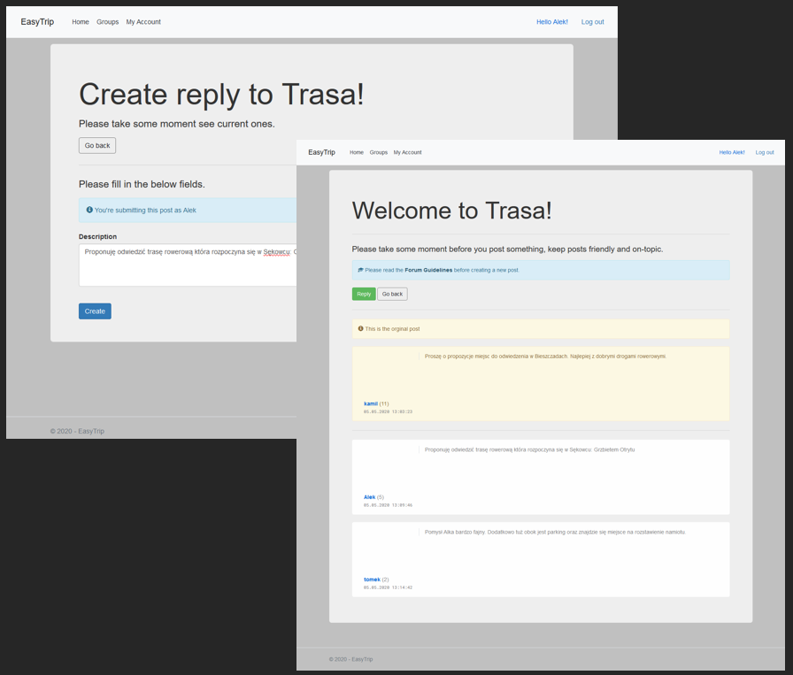

Easy trip app is a web application created for passing team project subject on Warsaw Uniwersity of Technology.

Application allows you to create groups of people interested in traveling together. 
Application enables communication between users of given groups using a forum.
Every group has admin user, who has more privilages than simple user that joins the group.

Main view:

login:

Browse and join groups:

Creating and deleting forum threads

Posting and chating:

The application was created with the help of Wes Doyle ASP.NET Core 2 MVC Forum Tutorial.
https://www.youtube.com/c/WesDoyle/
